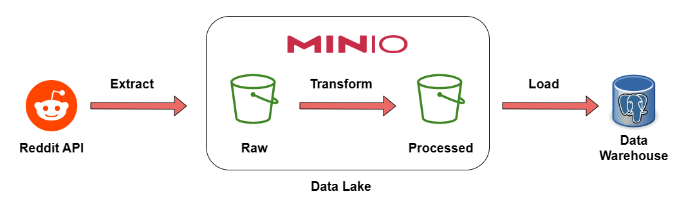

# Reddit Data Engineering Project

>This project is intended to create an ETL pipeline using Reddit'API.

## Prerequisites
Before running this script, you must have:

- A Reddit account
- A MinIO instance with credentials and endpoint URL
- Apache Spark installed
- Postgres installed

## Tools
* **Source:** Reddit API
* **DataLake:** MinIO
* **DataWarehouse:** Postgres
* **ETL Tool:** Apache Spark

## Architecture
