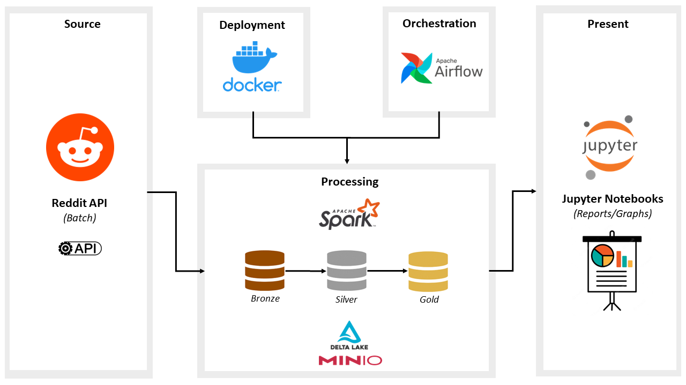

# Reddit Data Engineering Project

This project involves the creation of an ETL pipeline utilizing the Reddit API to extract data, transform it using Apache Spark, and store it in a MinIO DataLake. The pipeline is orchestrated using Apache Airflow and can be run within a Docker container.

## Prerequisites
Before running this script, make sure you have the following prerequisites:
- A Reddit account with API access. You will need the Reddit API credentials to authenticate and access the data.

## Tools and Technologies
The project utilizes the following tools and technologies:

* **Source:** Reddit API
  - The Reddit API is used as the source of data for this project. Specifically, data is extracted from the subreddit r/popular.

* **DataLake:** MinIO
  - MinIO is utilized as the DataLake in this project. MinIO is setup as Delta Lake. It can be easily set up on your local machine and serves as an S3-compatible storage solution.

* **ETL Tool:** Apache Spark
  - Apache Spark is employed in this project for data processing and transformation.

* **Orchestration Tool:** Apache Airflow
  - Apache Airflow is utilized in this project to automate workflow execution.

* **Container:** Docker
  - All of these tools are configured in the Docker Compose file, facilitating easy packaging and deployment of the application.

## Architecture
The project follows the medallion architecture depicted in the diagram below:



1. **Data Extraction**: The ETL process starts with extracting data from the Reddit API using the provided credentials. File `scripts/api_extract.py` is used to extract data from API and stored as json in `Landing Zone` in MinIO Data Lake.

2. **Data Ingestion**: Once the data is extracted, it is unnested and stored as `delta` in the `Bronze` layer of Data Lake.

3. **Data Transformation**: The raw data is then cleaned, transformed using Apache Spark and stored in `silver` layer.

4. **Data Loading**: The transformed data is then aggregated using Apache Spark and stored in `gold` layer.

5. **Data Visualization**: The aggregated data is then used to created dashboards in the `jupyter notebooks` to derive insights from the data.

6. **Orchestration**: The ETL pipeline is orchestrated using Apache Airflow in the `dags/et_dag.py`.

7. **Containerization**: The entire ETL pipeline, including the source code, dependencies, and configurations, is containerized using Docker.

## Getting Started
To get started with this project, follow these steps:

1. Clone the repository and navigate to the project directory.

```
$ git clone https://github.com/Abdullahdurrani/reddit-de.git
$ cd reddit-de
```

2. Set up the necessary environment variables and configurations. Create file `scripts/vars.py` with the following variables, Replace the values with your own credentials:
```
# reddit credentials
personal_use_script = "personal_use_script"
secret_token = "secret_token"
username = "username"
password = "password"
user_agent = 'user_agent'

# minio credentials
minio_endpoint = "http://minio:9000"
minio_access_key = "minio_access_key"
minio_secret_key = "minio_secret_key"
minio_region = "us-east-1"
minio_bucket = "reddit-datalake"
```

3. Build the Docker image for the project.
```
$ docker-compose build
```

4. Run the docker container
```
$ docker-compose up
```

5. Navigate to tools with following URLs.
```
MinIO: http://localhost:9090/
Airflow: http://localhost:8080
Jupyter: http://127.0.0.1:8888/lab
```
> To find the token for Jupyter find the `pyspark-jupyter` ID using `docker ps` and then `docker logs <ID>`

6. Create spark connection in airflow.
Navigate to Admin -> Connections and Create new connection with following details:
```
Connection Id: spark_default
Connection Type: Spark
Host: spark://localhost:7077
```

# Conclusion
This project showcases the process of building an ETL pipeline using the Reddit API, Apache Spark for data transformation, MinIO for data storage, Apache Airflow for orchestration, and Docker for containerization. It provides a robust and scalable solution for extracting, transforming, and loading Reddit data into a DataLake architecture. By following the steps outlined in the [Getting Started](#getting-started) section, you can easily set up and run the pipeline to process Reddit data for further analysis or insights.

Feel free to modify and customize the project according to your specific requirements and use cases. Contributions and feedback are always welcome!